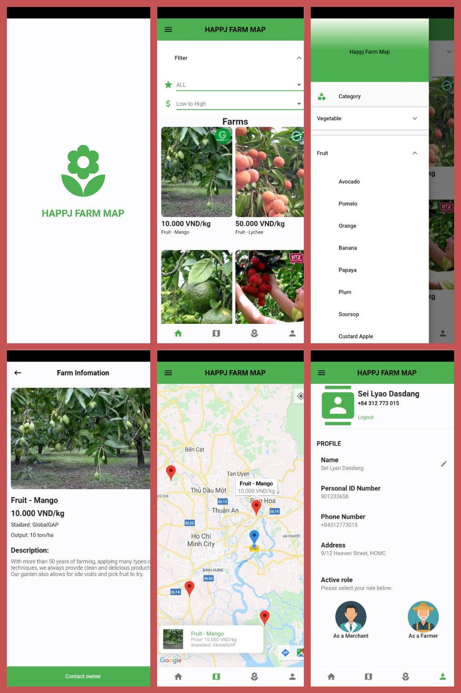

# HAPPJ FARM MAP
Easier getting agricultural products from everywhere.


## About The Project
As an international student from VietNam where agriculture employs more than 50% of the total workforce. We have come across many incidents in which farmers are suffering because of high debt burdens, corruption in subsidies, and crop failure. We thought to build something with our skills which gives them profit. We also decided to consider consumer satisfaction. Not getting enough money for their crop is the most serious problem they are facing right now. Eliminating third parties and connecting farmers with customers would be helpful for the agriculture sector.

## What it do
It is an application where farmers can post their crops those can be anything like vegetables, fruits or pulses and also the price of the product. the customer can search for nearby farms using google map and buy from this platform. We are responsible for the delivery of the products.

## Screenshots
<center>

</center>

## Built With
Flutter | Firebase | Google API

## Getting Started
1. Clone the project repo:
```bash
git clone https://github.com/Kianto/happjfarm.git
```
2. Register Google APIs [Maps SDK for Android and Maps SDK for iOS](https://console.cloud.google.com). Replace <GOOGLE_API_KEY> in the project by the key. Replace both AndroidManifest.xml file in android and Info.plist file in iOS.
3. For the app development in the future, it also need real-time database and authentication service on Firebase.
4. Open project by Android Studio or Visual Studio Code to build and run.

## License
Distributed under a HappjTech license.

## Contact
Kianto: lychinhky@gmail.com

Henry: discoverinvietnam@gmail.com

IF YOU THINK THAT YOU CAN HELP ME TO HELP OTHERS, PLEASE DO NOT HESITATE TO CONTACT ME.

